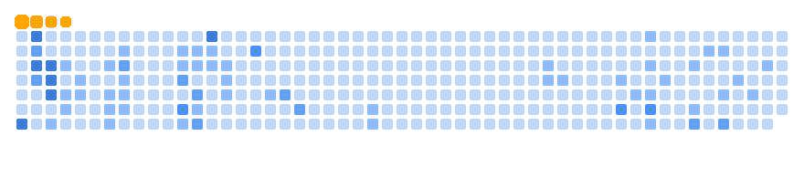

<!--
This area most for the empty commit to view any change in the README
-->
<!--
**sinwulok/sinwulok** is a ✨ _special_ ✨ repository because its `README.md` (this file) appears on your GitHub profile.

Here are some ideas to get you started:

- 🔭 I’m currently working on ...
- 🌱 I’m currently learning ...
- 👯 I’m looking to collaborate on ...
- 🤔 I’m looking for help with ...
- 💬 Ask me about ...
- 📫 How to reach me: ...
- 😄 Pronouns: ...
- ⚡ Fun fact: ...
-->

<!-- 🔥🔥🔥🔥🔥🔥🔥🔥🔥🔥🔥🔥🔥🔥🔥🔥🔥🔥🔥🔥🔥🔥🔥🔥🔥🔥🔥🔥🔥🔥🔥🔥🔥🔥🔥🔥🔥🔥🔥🔥🔥🔥🔥🔥🔥🔥🔥🔥🔥🔥🔥🔥🔥🔥🔥🔥🔥🔥🔥🔥🔥🔥🔥🔥🔥🔥🔥🔥🔥🔥🔥🔥🔥🔥🔥🔥🔥🔥🔥🔥🔥 ------------------------------------------------------------------------->
<h1 align="center">
  

    
    
    
    
  

  🔥🔥🔥 Welcome SINWU's Github 🔥🔥🔥
  

    
    
    
    
  

</h1>

  

Hi there 👋

I’m Maximilian LOK — a Full‑Stack Engineer focused on integrating AI into data‑science and system trading applications.

In the second half of 2025 I concentrated on two core projects: 
- [biu.1-ragme-github](https://github.com/sinwulok/biu.1-ragme-github) (a retrieval‑augmented assistant prototype)
- [biu.1-ai-quant](https://github.com/sinwulok/biu.1-ai-quant) (a real‑time multi‑asset detection and signal generation agent).

During that period I iterated on RAG pipelines and retrieval components, improved real‑time detection and signal workflows for multi‑asset trading, and explored Rust for high‑performance modules and Web3 experiments.

[You can also check my credentials page](https://sinwulok.github.io/credentials/). 

In 2026 I’ll be working to productionize these systems, improve robustness, and expand open‑source contributions.

<!-- 🛠️🛠️🛠️🛠️🛠️🛠️🛠️🛠️🛠️🛠️🛠️🛠️🛠️🛠️🛠️🛠️🛠️🛠️🛠️🛠️🛠️🛠️🛠️🛠️🛠️🛠️🛠️🛠️🛠️🛠️🛠️🛠️🛠️🛠️🛠️🛠️🛠️🛠️🛠️🛠️🛠️🛠️🛠️🛠️🛠️🛠️🛠️🛠️🛠️🛠️🛠️🛠️🛠️🛠️🛠️🛠️ ------------------------------------------------------------------------->
<!-- standard summary format -->

  
<h2> ✒️ Main Dev Languages </h2>

    <code></code>
    <code></code>
    <code></code>
    <code></code>
    <code></code>
    <code></code>
    <code></code>

  
<h2> 💡💬🦊 AI+ Extends </h2>

    <code></code>
    <code></code>
    <code></code>
    <code></code>
    <code></code>
    <code></code>
    <code></code>
    <code></code>
    <code></code>
    <code></code>

  
<h2> 🛠️☁️ Backend & Platforms </h2>

    <code></code>
    <code></code>
    <code></code>
    <code></code>
    <code></code>
    <code></code>
    <code></code>

  
<h2> 📲🎨 Client-Side Development </h2>

    <code></code>
    <code></code>
    <code></code>
    <code></code>
    <code></code>
    <code></code>
    <code></code>
    <code></code>
    <code></code>
    <code></code>
    <code></img></code>
    <code></img></code>
    <code></code>

  
<h2> ⚙️🔄 Infrastructure & Tools </h2>

    <code></code>
    <code></code>
    <code></code>
    <code></code>
    <code></code>
    <code></code>
    <code></code>

  
<h2> 💾📊 Databases & Data Science </h2>

    <code></code>
    <code></code>
    <code></code>
    <code></code>
    <code></code>
    <code></code>
    <code></code>

<h1></h1>

  
  
  <!-- GitHub Snake Ocean --> <!-- &exclude_repo=Nilearn_extend_study_fmri&E-Learning-FA -->
    

<!--

-->
